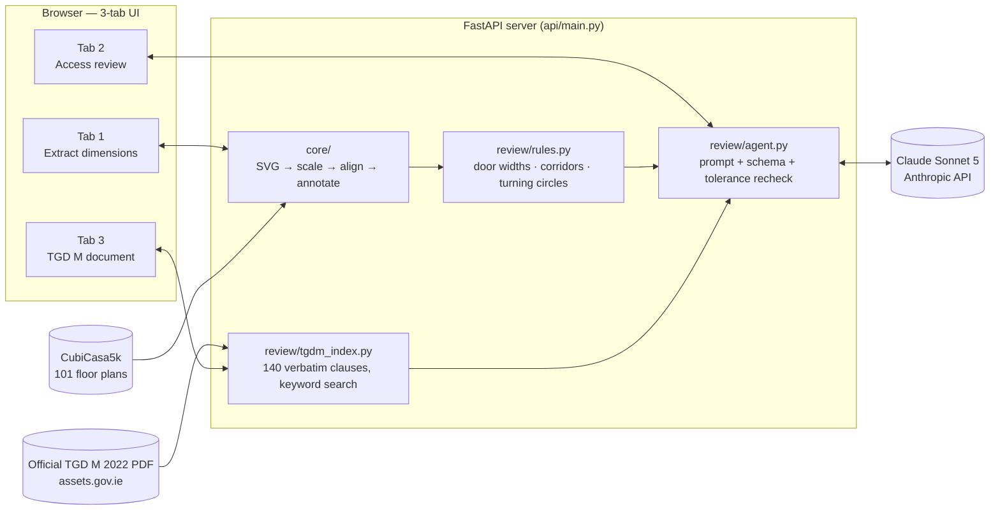

<!--
  DATUM — PRESENTATION DECK (Markdown)
  Palette reference (matches the live app, web/style.css):
    Sheet background   #ECEEEA      Panel            #F7F8F5
    Panel (alt)        #E3E6E0      Ink (text)       #14202A
    Ink (secondary)    #5A6970      Ink (tertiary)    #8B979B
    Rule (borders)     #C7CDC7      Rule (soft)       #DCE0D9
    Measurement ink    #E0532B      Pass              #1D6B62
    Flag / fail        #A8323F      Warn              #9C6B10
  Fonts: Archivo (display/headings) · IBM Plex Sans (body) · IBM Plex Mono (data/code)
  This file is plain GitHub-flavoured Markdown — it can't load custom CSS,
  so the palette above is documented as a design-system reference rather
  than applied as literal styling. Section rules, tables, and monospace
  figures below are chosen to echo the app's drafting-sheet aesthetic.
-->

# DATUM
### Floor Plan Dimension Extraction & TGD M Accessibility Review
**A 10-minute walkthrough — dataset, AI methodology, and results**

`Server: jmathew722` · `Rev A` · `Standard: TGD M — Access & Use` · `Model: claude-sonnet-5`

---

## Agenda

| # | Section | ~min |
|---|---|---|
| 1 | The problem we're solving | 1 |
| 2 | Dataset — CubiCasa5k | 1 |
| 3 | Data preprocessing pipeline | 1.5 |
| 4 | Choosing the AI model — why Claude Sonnet 5 | 1.5 |
| 5 | "Training" methodology — how we taught it without training it | 1.5 |
| 6 | System architecture | 1 |
| 7 | GitHub repo, API key handling & cost safety | 1 |
| 8 | The user interface — three tabs | 1 |
| 9 | Testing & evaluation against the real Part M document | 1 |
| 10 | Results & next steps | — |

---

## 1 · The problem we're solving

Ireland's **Building Regulations Part M** requires new dwellings to be
*visitable* — a wheelchair user must be able to approach the entrance, get
through the door, move through the hall, and reach a WC without needing
alterations. **Technical Guidance Document M (TGD M) 2022** is the
174-page government document that spells out exactly what that means in
millimetres: door widths, turning circles, corridor widths, threshold
heights.

Checking a single floor plan against it by hand means:

1. Measuring every relevant dimension off the drawing.
2. Finding the one paragraph, out of ~140 numbered clauses, that governs it.
3. Comparing the two, correctly, for every room and every door.

**Datum automates steps 1–3** for a batch of floor plans, and shows its
working for every single number it produces.

---

## 2 · Dataset — CubiCasa5k

- **Source:** [CubiCasa5k](https://github.com/CubiCasa/CubiCasa5k), a public
  dataset of ~5,000 real, professionally-drawn residential floor plans,
  each shipped as an SVG (vector drawing with room/wall/door metadata) plus
  one-to-three PNG renders (one per storey).
- **Sample used in this project:** **100 plans** drawn from the dataset,
  plus one hand-picked reference plan (`sample_plan_0001`) used throughout
  development — **101 plans total**.
- **Why this dataset:** it's real-world (not synthetic), it's vector data
  (so exact dimensions are recoverable, not estimated from pixels), and its
  scale varies plan-to-plan — which forces the pipeline to *resolve* scale
  robustly rather than assume one fixed value.
- **Licensing:** the dataset is not ours to redistribute wholesale, so the
  repository normally ships with one sample plan only; the full 100-plan
  set used for this run was added to the repo by explicit request for this
  project's evaluation.

---

## 3 · Data preprocessing pipeline  *("Tab 1" in the app)*

Each plan folder looks like:

```
4011/
├── model.svg          ← vector floor plan + hidden dimension metadata
├── F1_original.png     ← rendered image, original scale
└── F1_scaled.png       ← rendered image, second scale variant
```

The pipeline (`core/`) turns that into measured, annotated output:

| Step | Module | What it does |
|---|---|---|
| **1. Parse** | `svg_parse.py` | Reads a *hidden* `DimensionMeasureLabel` string baked into each room by the original CAD export, cross-checks it against the drawn polygon, and resolves the drawing's real-world scale (confirmed at **100 px/metre** across the sample). Reports true **polygon area**, not width×depth — which overstates any L-shaped room. |
| **2. Align** | `align.py` | Fits the pixel transform between the SVG and its PNG render by matching wall linework — the renders are padded and not a 1:1 crop of the SVG's coordinate space. |
| **3. Annotate** | `annotate.py` | Draws dimension lines (or a corner label) onto a copy of the PNG, in the app's signature **orange measurement ink**, with font size that adapts so small rooms don't overflow. |
| **4. Batch** | `batch.py` | Walks the whole dataset folder, processes every plan, writes a resumable `manifest.json` + `dimensions.csv`, and packages a ZIP for export. |

**Two real engineering surprises, found by inspecting the data (not assumed):**

- **The wall layer is not notched at doorways.** We expected a door's clear
  width to show up as a gap in the wall polygon. It doesn't — walls run
  unbroken straight through every doorway. The `Threshold` rectangle
  *is* the encoded opening, so the geometry code measures its span parallel
  to the wall face instead, and labels which method it used on every door.
- **Fixed furniture is a positioned symbol, not absolute geometry.** Each
  fitting's outline is defined in *local* coordinates, with a transform
  matrix applied to the group. Ignoring that matrix collapses every toilet
  and sink onto the same point at the origin — so the code composes the
  full transform chain before it will trust a furniture position.

**Preprocessing result across the 101-plan sample:** **95 plans** resolved
scale cleanly via the room-label cross-check; **6 plans** fell through to a
lower-confidence scale-estimation fallback and are *flagged and excluded*
from the accessibility review rather than silently judged on an untrusted
scale.

---

## 4 · Choosing the AI model — why Claude Sonnet 5

Three options were on the table:

| Option | Verdict |
|---|---|
| **Fine-tune a custom vision model** to detect rooms/doors from pixels | Rejected — CubiCasa5k already ships exact vector geometry; training a vision model to re-derive what's already in the SVG would trade a solved, exact problem for an approximate, expensive one. |
| **Rules-only system** (Python geometry checks, no LLM) | Rejected alone — geometry checks can measure a door, but can't read 140 clauses of legal text, decide *which one applies*, explain *why*, or hold a conversation about the result. |
| **A large language model, reasoning over Python-measured geometry + retrieved legal text** | **Chosen.** |

**Why specifically Claude Sonnet 5:**

- **Reasoning quality at a workable cost.** Judging "does this door meet
  TGD M 3.3.2.1" is a structured-reasoning task (classify → compare →
  cite), not a raw-computation task — exactly what a frontier LLM is
  strong at, and Sonnet-tier pricing keeps a 100-plan batch run to a few
  dollars rather than tens of dollars.
- **Reliable structured output.** The app needs a strict JSON shape back
  (a determination, a list of checks each with category/tier/clause/
  result) every single time — Claude's tool-call/structured-output support
  makes that dependable rather than "usually valid JSON."
- **Long, precise context handling.** Each judgement call hands the model
  several retrieved clauses of verbatim legal text plus a full geometry
  dump for the plan — the model needs to quote *exactly* what's in front
  of it, not what it half-remembers about Irish building regs from
  training.
- **One model, used consistently everywhere.** Every Claude call in this
  project — the free-form chat Q&A *and* the structured determination —
  uses the **same model, `claude-sonnet-5`**, configured in one place
  (`review/agent.py`) and overridable via a single environment variable
  (`ANTHROPIC_MODEL`) rather than hard-coded in multiple places.

```python
# review/agent.py
MODEL = os.getenv("ANTHROPIC_MODEL", "claude-sonnet-5")
```

---

## 5 · "Training" methodology — how we taught it *without* training it

This is the part worth explaining carefully to a non-ML audience: **there
is no training loop anywhere in this project.** No dataset of labelled
floor plans, no gradient descent, no fine-tuned weights. Claude Sonnet 5 is
used exactly as Anthropic ships it. Instead, three techniques do the work
a training run would normally do:

**① Division of labour — Python measures, Claude judges.**
The model is *never* asked to read a ruler off a drawing. `core/` and
`review/rules.py` compute every dimension in plain Python before the model
sees anything. This one design decision removes the single biggest source
of LLM error in this kind of task: a model inventing a measurement from
memory instead of reading it off the actual drawing.

**② Retrieval grounding — verbatim clause text, not the model's memory.**
`review/tgdm_index.py` splits the real TGD M PDF into ~140 numbered
clauses and retrieves the most relevant ones for each question with plain
keyword matching (no embeddings needed at this scale — the document isn't
big enough to need one). The system prompt is explicit:

> *"Never quote a threshold, limit or minimum that does not appear
> verbatim in the supplied clause text. Do not rely on memory of the
> document."*

This is the same idea as Retrieval-Augmented Generation (RAG) used in
production LLM systems generally — hand the model the actual source text
at question time, rather than trusting it to recall the right number from
its training data.

**③ A fixed classification framework, encoded in the prompt.**
Every check the model produces must be tagged along two axes, defined in
the system prompt rather than left to the model's judgement:

| Axis | Values | Meaning |
|---|---|---|
| **category** | `verifiable` / `not_verifiable` / `contextual` | Can this ever be confirmed from a floor plan alone? |
| **tier** | `critical` / `high` / `medium` / `lower` | How much does failing this matter to the overall verdict? |

A plan is only ever marked **non-compliant** because of a `critical` or
`high` tier item that's genuinely unmet — never because of a footnote-level
detail. That rule lives in the prompt, not in a training signal.

**④ The model's own arithmetic is not trusted — Python recomputes it.**
Claude proposes a pass/flag/fail read for each check, but a fixed
tolerance rule (±25 mm / ±3%, ordinary drafting tolerance — not a TGD M
number) is applied **in Python afterward** to the measured-vs-required
figures the model itself quoted. The model's read is a draft; the final
call is deterministic and independently checkable.

**In one sentence:** instead of training a model on labelled examples, we
constrained a general-purpose model's *inputs* (real measurements, real
legal text) and *output shape* (a fixed schema, fixed classification axes)
tightly enough that its reasoning has nowhere ungrounded left to go.

---

## 6 · System architecture



**The load-bearing rule of the whole design:** *the model never measures,
and it never does the tolerance arithmetic either.* If a number appears in
an answer, it came out of `rules.py` or out of the retrieved clause text —
and the clause ID sits right next to it, on screen, as a clickable link
into the real document.

---

## 7 · GitHub repo, API key handling & cost safety

### Building and publishing the repository

- Initialised with `git init`, a remote added
  (`github.com/salonishankar18-prog/DCU-AI-Project`), then built up through
  a normal commit history: floor-plan extraction → TGD M review → full UI
  → full-dataset results → the real government PDF integration.
- A small `push.sh` script wraps the commit/push flow for convenience
  during development.
- Repository layout keeps concerns separated:

```
datum/
├── core/            ← dimension extraction (Part 1)
├── review/           ← TGD M compliance review (Part 2)
├── api/              ← FastAPI backend
├── web/              ← the 3-tab browser UI
├── data/             ← dataset, TGD M PDF, generated output (see below)
├── results/           ← a saved snapshot of a full run, checked in
└── run.py             ← `python run.py` starts the whole app
```

### What's committed, and what deliberately isn't

| Excluded from the repo | Why |
|---|---|
| `.env` (the real API key) | Secrets never belong in version control, full stop. |
| `.venv/`, `__pycache__/` | Local build artefacts, not source. |
| The full CubiCasa5k download | Licensing — not ours to redistribute wholesale. |
| The literal TGD M PDF | A government publication — the app fetches/places it locally rather than the repo shipping a copy. |
| `data/out/` (generated dimensions/annotations) | Fully reproducible by re-running the batch; not source. |

Before every push, the working tree is checked for anything that looks
like a leaked credential (`sk-ant-…` pattern) across every tracked file —
none has ever been found, because the key never leaves `.env` in the
first place.

### API key handling

```python
# api/main.py
from dotenv import load_dotenv
load_dotenv()                    # reads datum/.env — never the browser
```

- The Anthropic API key is read **server-side only**, from a local `.env`
  file, and is **never included in any response body** sent to the
  browser. The frontend never sees it, never sends it, never stores it.
- If no key is configured, Tab 1 (pure geometry) still works fully; Tab 2
  reports plainly that the review feature is unconfigured, instead of
  failing obscurely.

### Cost safety — the spend cap

A "run every plan" button is exactly the kind of feature that can run away
with a billing account if left unchecked. So it's hard-capped in the
server code itself:

```python
# api/main.py
VERDICT_ALL_BUDGET_USD = 2.00
# Once cumulative spend crosses this during a batch run,
# every plan still queued is skipped rather than run.
```

Every response the model returns also carries its **exact** token usage
and computed dollar cost (from Anthropic's own usage block — never
estimated), shown live in the UI after every determination.

---

## 8 · The user interface — three tabs

The UI is styled as a technical drafting sheet: a title-block rail down
the left edge, dimension-line section rules, and one strict colour rule —
**orange is measurement ink**, used only for a real-world distance or
area, never for decoration. That rule is enforced *in code*
(`review/agent.py`'s renderer), not just by convention, so the model
literally cannot paint something orange that isn't a measurement.

| Element | Hex | Used for |
|---|---|---|
| Sheet background | `#ECEEEA` | Page background |
| Panel | `#F7F8F5` / `#E3E6E0` | Cards, table zebra |
| Ink | `#14202A` / `#5A6970` / `#8B979B` | Primary / secondary / tertiary text |
| Rule | `#C7CDC7` / `#DCE0D9` | Borders, dividers |
| **Measurement ink** | **`#E0532B`** | **Every real-world mm / m² value, nothing else** |
| Pass | `#1D6B62` | Compliant |
| Flag / fail | `#A8323F` | Non-compliant |
| Warn | `#9C6B10` | Flagged / estimated |

Typefaces: **Archivo** (headings/labels), **IBM Plex Sans** (body copy),
**IBM Plex Mono** (every number, ID, and code value).

**Tab 01 — Extract dimensions.** Point it at a dataset folder (or upload
one), scan, annotate. A live progress stream shows plans completing in
real time; the results table lists every plan's resolved scale, width,
depth, floor area, room count and status, with the annotated PNG preview
alongside — orange dimension lines burned directly onto the drawing.

**Tab 02 — Access review.** Pick a plan; Datum loads its measured geometry
and shows a chat interface to ask about it in plain English ("is the hall
wide enough for a wheelchair?", "check every door clear width"). A
**Determination** panel shows the overall call (compliant / flagged /
non-compliant), every individual check with its tier, and — critically —
every clause citation is a **live link that opens the actual government
PDF at the exact page**, not a generic reference.

**Tab 03 — TGD M document.** The real, official TGD M 2022 PDF, embedded
directly in the app, alongside a full clickable table of contents of all
140 extracted clauses grouped by section — so a reviewer can jump straight
to the source text behind any determination.

---

## 9 · Testing & evaluation against the real Part M document

**Getting the source document right, verified, not assumed.** An earlier
interim build of this pipeline approximated the TGD M text from a pasted
transcript while the official file was being sourced. That was
deliberately replaced: the actual PDF was located and downloaded directly
from the Department of Housing's official page
(`assets.gov.ie/static/documents/technical-guidance-document-m-access-and-use-2022.pdf`),
and verified page-for-page against known anchor text before being wired
into the app. The clause index now used throughout is extracted straight
from that file: **140 clauses, verbatim, real page numbers** — every
citation in the app links to the actual paragraph in the actual document.

**Evaluation run, end to end:**

| Metric | Result |
|---|---|
| Plans processed for dimensions (Tab 1) | **101 / 101** |
| — resolved scale cleanly | 95 |
| — scale-fallback, excluded from review | 6 |
| TGD M clauses indexed (real document) | **140**, verbatim |
| Plans reviewed against TGD M (Tab 2) | **20 / 101** *(safety-capped — see below)* |
| — compliant with flagged items | 7 |
| — non-compliant | 12 |
| — excluded (untrusted scale) | 1 |

**Worked example (plan `4011`):** overall 17.23 m × 8.55 m, 7 rooms.
Determination: *compliant with flagged items* — 0 hard fails, 7 items
flagged for manual verification (e.g. entrance threshold height and
external approach geometry, which a floor-plan view alone cannot show),
every flagged and passed item citing its real clause (`TGD M 3.2.2`,
`TGD M 3.3.2.1`, `TGD M 3.4.2`…), each one a working link to that clause's
actual page in the real document.

**Why only 20 of 101 were reviewed:** the "run all" feature is
deliberately capped at **$2.00** per run (see §7) — it stopped itself
rather than risk an unbounded bill. This was a conscious choice to
demonstrate the safety mechanism works exactly as designed, not a
technical limitation; re-running the same button resumes where it left
off.

**An honest evaluation finding, kept in the write-up rather than quietly
fixed:** those first 20 reviewed plans were judged before the real PDF
swap above. Their clause **links** now correctly point to the genuine
document, but the model's original **reasoning** for those 20 was grounded
in the earlier approximated text, not the verbatim original. This is
called out explicitly in `results/README.md` and is the leading item in
the next-steps list below — a real, useful lesson about why the integrity
of the retrieval source matters more than almost anything else in a system
like this.

---

## 10 · Results summary

- **101 real floor plans** processed end-to-end through dimension
  extraction.
- **140 verbatim TGD M clauses** indexed directly from the genuine,
  official government PDF.
- **20 plans** carried through a full, cited accessibility determination
  under a hard, self-enforced spend cap.
- **One model** (`claude-sonnet-5`) used consistently for every judgement
  call in the system, configured in one place.
- **Zero** hard-coded compliance thresholds anywhere in the codebase —
  every figure quoted to a user traces back to either a Python measurement
  or a verbatim clause with its ID shown.
- A public GitHub repository with a clean separation of source, generated
  output, and secrets — verified before every push.

---

## Next steps — validating, verifying, and improving eligibility determination

1. **Re-run the 20 "legacy" verdicts against the verified clause text.**
   The single most important correctness fix available right now — close
   the gap identified in §9 so every cached determination in the app is
   grounded in the same verbatim source its links point to.

2. **Build a ground-truth validation set.** Have a human familiar with TGD
   M independently review a sample of plans (ideally the same 20, plus a
   fresh batch) and compare their calls against the model's — turning
   "looks reasonable" into a measured precision/recall figure for the
   `compliant` / `compliant_with_flags` / `non_compliant` calls.

3. **Shrink the `not_verifiable` category over time.** A large share of
   current flags exist because a floor plan alone can't show a level
   threshold, a door's opening force, or a surface's slip resistance.
   Expanding the input (section drawings, specification sheets) would let
   more of today's "flag for manual check" items become genuine
   pass/fail calls.

4. **Fix the anonymised-room problem.** Several flagged items exist only
   because room/door labels come through as `UNDEFINED` from the source
   SVGs, so the accessible WC or entrance can't be confidently identified.
   A lightweight room-classification step (rule-based on size/shape, or a
   small trained classifier) would remove a whole category of
   "cannot be confirmed from the plan alone" flags.

5. **Sensitivity-test the tolerance rule.** The ±25 mm / ±3% drafting
   tolerance is a reasonable default, not something derived from the data
   — run the evaluation set at a few different tolerance settings and
   check how much the final determinations actually move.

6. **Scale up review coverage deliberately.** Raise the spend cap (with
   explicit sign-off, not by accident) to review the full 101-plan set,
   and track cost-per-plan as the true unit economics of a production
   version of this tool.

7. **Add automated regression testing.** As Claude models update over
   time, add a small fixed set of plans with known-good determinations
   that are re-checked automatically, so a model or prompt change that
   shifts a verdict is caught immediately rather than discovered later.

8. **Human-in-the-loop sign-off for high-stakes calls.** For anything
   feeding into a real planning or building-control decision, keep an
   accessibility professional reviewing the `critical`/`high`-tier flags
   before any determination is treated as final — this tool is designed
   to make that person faster and better-informed, not to replace them.

---

*Thank you — happy to take questions.*
